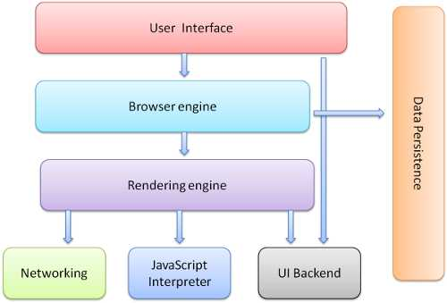

#### node
> 1 node 基于V8的Javascript运行环境 
  2 单线程 非阻塞I/O（数据库的请求不会阻塞主线程） 
  3 事件驱动
##### node 优点
- 节约内存
- 节约上下文环境 context切换开支
- 并发资源的处理，无需加锁

##### 进程 
> 操作系统分配资源和调度任务的基本单位，一个进程可以有多个线程

##### 浏览器模型
- 用户界面
- 渲染引擎（JS线程 UI线程）
- 浏览器引擎 在用户界面和渲染引擎之间传送指令
- 网络请求
- 数据存储 持久层

> webworker 多线程 完全受主线程控制，不能操作DOM

##### eventloop
- 所有同步任务在主线程执行，形成一个执行栈
- 异步任务队列  先进先出 （主线程之外），异步任务有运行结果以后向异步队列添加一个事件任务
- 执行栈中所有的同步任务执行完毕，系统会读取异步任务队列中的一个任务到执行栈执行

